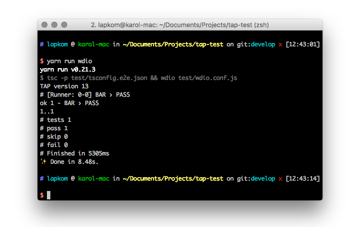

WDIO Tap reporter
==================

[](https://badge.fury.io/js/wdio-tap-reporter) [](https://www.npmjs.com/package/wdio-tap-reporter) [](https://circleci.com/gh/LKay/wdio-tap-reporter/tree/master) [](https://coveralls.io/github/LKay/wdio-tap-reporter) [](https://david-dm.org/lkay/wdio-tap-reporter?type=dev)

> A WebdriverIO plugin to report in TAP format style. 
> Output is based on specification for [TAP13](https://testanything.org/tap-version-13-specification.html) 



## Installation

The easiest way is to keep `wdio-tap-reporter` as a devDependency in your `package.json`.

```json
{
  "devDependencies": {
    "wdio-tap-reporter": "~0.0.4"
  }
}
```

You can simple do it by:

```bash
npm install wdio-tap-reporter --save-dev
```
or if you are using [yarn](https://yarnpkg.com) (which I recommend):

```bash
yarn add wdio-tap-reporter -D
```

Instructions on how to install `WebdriverIO` can be found [here](http://webdriver.io/guide/getstarted/install.html).

## Configuration

Following code shows the default wdio test runner configuration. Just add `'tap'` as reporter
to the array.

```js
// wdio.conf.js
module.exports = {
  // ...
  reporters: ['dot', 'tap'],
  // ...
};
```

## Usage

Reporter outputs tests results in the TAP format and thus the output 
is compatible with [any TAP reporter](https://github.com/sindresorhus/awesome-tap#reporters).

Simply pipe the output to reporter you want to use: 

```bash
wdio | tap-nyan
```


